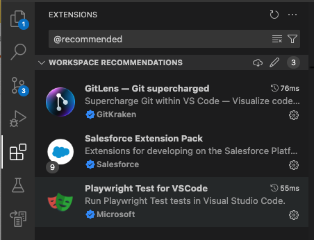
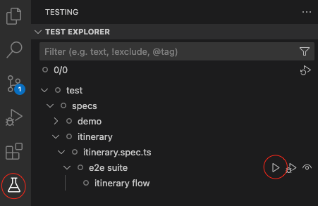
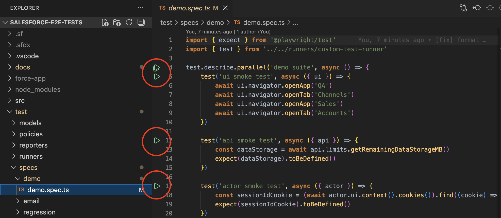

## Salesforce E2E Test Automation Framework

An example of an E2E test automation project for Salesforce UI and API layers.

This is a portfolio piece rather than a product.

**stack**

- [playwright](https://playwright.dev)
- [salesforce cli](https://developer.salesforce.com/tools/salesforcecli)
- [jsforce](https://jsforce.github.io)
- [faker](https://fakerjs.dev)
- [nodejs](https://nodejs.org)
- [typescript](https://www.typescriptlang.org)

**design**

- page object model _POM_
- service object model _SOM_
- discoverable api via _fixtures_ and _fluent interface_

It works best with [vsc](https://code.visualstudio.com) as it has extensions for [playwright test](https://www.npmjs.com/package/@playwright/test) and [salesforce](https://www.salesforce.com). Clones like `cursor` or `antigravity` should also work fine.

---

### Local Setup Instructions

#### Prerequisites:

1. **Git**
    - Check if already installed in the terminal: `git --version`
    - Download from [git-scm.com](https://git-scm.com/downloads)

2. **Node.js**
    - Check if already installed in the terminal: `node --version`
    - Version should be 22.xx
    - Download the latest LTS version with NPM from [nodejs.org](https://nodejs.org/en/download/)

3. **Salesforce CLI**
    - Check if already installed in the terminal: `sf --version`
    - If already installed update to the latest version via the terminal: `sf update`
    - Installation instructions available from [developer.salesforce.com](https://developer.salesforce.com/tools/salesforcecli)

4. **Java JDK (required for VS Code Salesforce Extensions Pack)**
    - Check if already installed in the terminal: `java --version`
    - Version should be either 11.xx, 17.xx, or 21.xx
    - Download from [oracle](https://www.oracle.com/pl/java/technologies/downloads/#java21)

5. **VS Code**
    - Download from [code.visualstudio.com](https://code.visualstudio.com/Download)
    - If already installed update to the [latest version](https://code.visualstudio.com/docs/setup/setup-overview#_update-cadence)

#### Clone and Configs:

1. **Clone Repository**
    - Clone the repository from [github](https://github.com/dawiddiwad/salesforce-e2e-test-automation) using terminal command:
        ```bash
        git clone https://github.com/dawiddiwad/salesforce-e2e-test-automation.git
        ```

2. **Open Cloned Repository in VS Code**
    - Open VS Code and set `salesforce-e2e-test-automation` as a project root folder using `File -> Open Folder... -> salesforce-e2e-test-automation`

3. **VS Code Extensions (managed inside VS Code on the Extensions tab)**
    - Press `CTRL + SHIFT + P` (Windows/Linux) or `CMD + SHIFT + P` (macOS)
    - Select the command from the palette: `Show Recommended Extensions`:

        

    - Install all extensions listed above or use a list below:
        - [playwright test for vscode](https://marketplace.visualstudio.com/items?itemName=ms-playwright.playwright)
        - [salesforce extension pack](https://marketplace.visualstudio.com/items?itemName=salesforce.salesforcedx-vscode)
        - [gitlens](https://marketplace.visualstudio.com/items?itemName=eamodio.gitlens)

4. **Install Dependencies**
    - Open a terminal inside VS Code and run the following commands:
        ```bash
        npm install
        npx playwright install
        ```

5. **Authorize Target Sandbox(es) Using Salesforce CLI**
    - Press `CTRL + SHIFT + P` (Windows/Linux) or `CMD + SHIFT + P` (macOS)
    - Select the command from the palette: `SFDX: Authorize an Org`
    - Choose a `Sandbox` option
    - Assign a name to the sandbox alias (can be anything)
    - Browser window with Salesfroce Sandbox login page should popup
    - Log in to the sandbox using username and password

6. **Configure Xray integration**
    - create `.env` file based on [.env.example](./.env.example) in the root of the project folder `salesforce-e2e-test-automation`
    - declare `XRAY_PROJECT_KEY` Jira key for the project, example: `TA`
    - declare `XRAY_TESTPLAN_KEY` ticket key for the testplan on which results are stored, example: `TA-11848`
    - decalre `XRAY_CLIENT_ID` and `XRAY_CLIENT_SECRET` api keys that you can acquire from Jira admin
    - example `.env` file should look like this:
        ```bash
        XRAY_PROJECT_KEY=TA
        XRAY_TESTPLAN_KEY=TA-11848
        XRAY_CLIENT_ID=99905CAD14BA4A81B47CF9EBA8A19666
        XRAY_CLIENT_SECRET=99942accb77334c5233ca311591cd57fe121dd1e9f59f2b2d5609d2e9c856666
        ```
    - if you just want to stop posting results automatically to Xray after each run, decalre additional variable in `.env` file: `XRAY_STOP_POSTING=true` in such case .json file will be generated in the `./test-reposrts/xray` folder that can be uploaded manually to Xray.
    - if you want to **enable Xray integration** declare `XRAY_ENABLE=true` in `.env` file, otherwise the Xray reporter will be disabled and no other `XRAY_xx` variables are required.

#### [running tests](https://playwright.dev/docs/running-tests):

- **Option A**: Run tests [using cli commands](https://playwright.dev/docs/running-tests#command-line) inside [vsc terminal](https://code.visualstudio.com/docs/terminal/getting-started):

    ```bash
    # --- example playwright test commands ---

    # run demo test only - good for initial setup verification
    npm run test:demo

    # run individual tests by tag
    npx playwright test --grep=@TA-12166

    # run all regression tests
    npm run test:regression

    # run all the tests - NOT ADVISED to begin with ;)
    npm run test:all
    ```

- **Option B**: [Inside vsc](https://playwright.dev/docs/getting-started-vscode#running-tests) select tests to run from the Test Explorer tab:

    

- **Option C**: [Inside vsc](https://playwright.dev/docs/getting-started-vscode#running-tests) click on the play button next inside a `.spec` file to execute specific tests:
  

#### Viewing Reports:

Most verbose report for debugging is the [html](https://playwright.dev/docs/test-reporters#html-reporter) document that can be found in `./test-reports/html`

- If **any tests _fail_** it will open automatically in the Browser
- If **all tests _pass_** it can be accessed by hosting using cli command: `npm run show:report`
    - ...or by opening `./test-reports/html/index.html` file in the Browser

##

See [developer guide](./docs/DEVELOPER_GUIDE.md) to read more.
